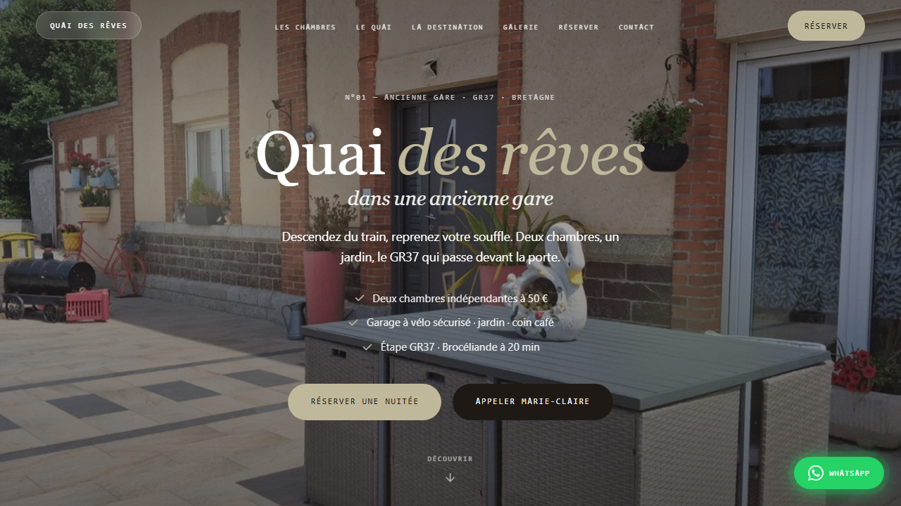

# Quai des Rêves



Landing pour **Quai des Rêves**, chambre d'hôtes dans une ancienne gare à Saint-Méen-le-Grand (Bretagne) — étape **GR37**.

| | |
|---|---|
| **URL production** | https://quai-des-reves.vercel.app |
| **Dépôt GitHub** | [github.com/dariohd/QuaiDesReves](https://github.com/dariohd/QuaiDesReves) |
| **Notes techniques** | [docs/ARCHITECTURE.md](docs/ARCHITECTURE.md) |
| **Hébergement** | Vercel |
| **Création** | [Bulle ton site](https://bulletonsite.com) — Hugo Davion |

## Stack

- HTML5, CSS3, JavaScript vanilla
- Polices auto-hébergées (Instrument Serif, Inter Tight, JetBrains Mono)
- Images WebP + fallback PNG (`<picture>`)
- Formulaire réservation → **mailto** pré-rempli (contact direct Marie-Claire)
- Carte **OpenStreetMap** embed
- Vercel : clean URLs, cache fonts/images

## Fonctionnalités

- **Storytelling** vertical : hero, chambres, équipements, destination, galerie
- 2 chambres à 50 €/nuit, garage vélo, GR37, Brocéliande
- **Galerie** lightbox (navigation clavier + swipe)
- **Avis** clients (carrousel)
- **FAQ** accordéon
- Formulaire réservation (nom, dates, chambre, petit-déjeuner option)
- Bouton **WhatsApp** flottant
- **Mentions légales** (LCEN, RGPD, cookies)
- Responsive : 1024px / 768px (menu mobile slide-in)
- JSON-LD : LodgingBusiness, FAQ, WebSite

## Structure

```
QuaiDesReves/
├── index.html
├── mentions-legales.html
├── css/styles.css
├── js/main.js
├── fonts/
├── images/
├── scripts/
├── vercel.json
├── sitemap.xml
├── robots.txt
├── favicon.svg
└── site.webmanifest
```

## Prérequis

- Node.js 18+ (scripts images/polices)
- Projet Vercel lié au dépôt GitHub

## Développement local

```bash
npx serve . -l 3458
```

→ http://localhost:3458

Chemins assets en absolu (`/css/styles.css`, `/js/main.js`) — servir via HTTP, pas en `file://`.

## Scripts de maintenance

```bash
node scripts/vendor-fonts.mjs      # Polices locales
node scripts/optimize-images.mjs   # Conversion / compression WebP
node scripts/wrap-images.mjs       # Balises <picture> automatiques
```

## Déploiement

Push `main` → Vercel auto-deploy.

Domaine custom optionnel dans Vercel (Settings → Domains).

À vérifier :
- CSS/JS chargés (pas de redirect cross-domain sur les assets)
- `/mentions-legales` sans `.html`
- Images hero + galerie
- Liens WhatsApp / téléphone / email

## URLs propres

`vercel.json` : `cleanUrls: true`, redirect `/mentions-legales.html` → `/mentions-legales`.

Canonical : `https://quai-des-reves.vercel.app`

## Conformité

- Page `/mentions-legales` (Marie-Claire Paul, Vercel, Bulle ton site)
- Pas de cookie tracking / analytics tiers
- Polices hébergées localement

## Contact

- **Client** : Marie-Claire Paul — Place de la Gare, 35290 Saint-Méen-le-Grand
- **Tél.** : 06 88 01 37 29
- **Développement** : [bulletonsite.com](https://bulletonsite.com)
